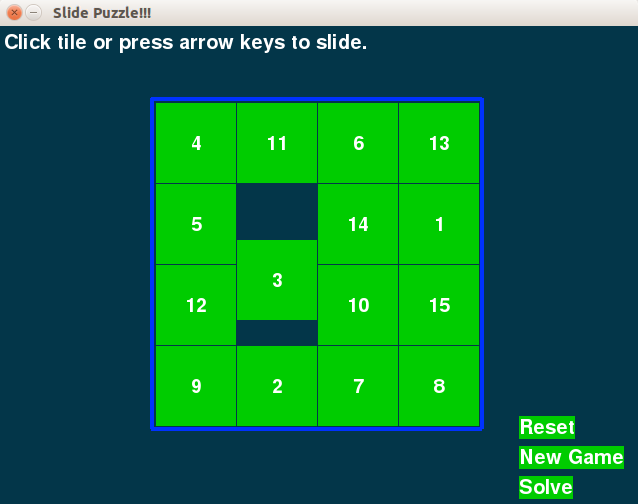
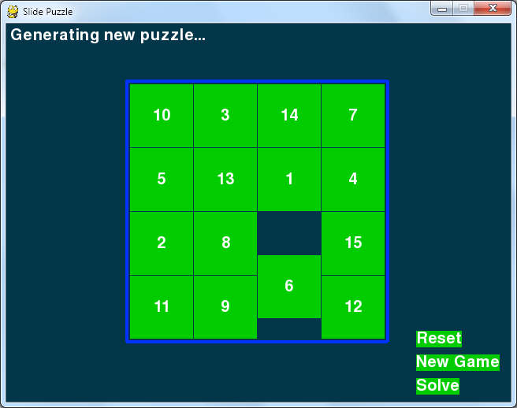

# SlidePuzzle
A Slide Puzzle made using [python-pygame](http://www.pygame.org)

How-to
------

1. Install Python 2.7.X from [here](https://www.python.org/download/releases/)

2. Install PyGame 1.9.X from [here](http://www.pygame.org/download.shtml)

3. Clone this repository: `git clone https://github.com/Arjav96/SlidePuzzle.git` or click `Download ZIP` in right panel and extract it.

4. Run `python SlidePuzzle.py` from the repo's directory

  (Note: Install pygame for same version python as above)

  (For x64 windows, get exe [here](http://www.lfd.uci.edu/~gohlke/pythonlibs/#pygame))
  

How to Play Slide Puzzle
--------------------------
The board is a 4x4 grid with fifteen tiles (numbered 1 through 15 going left to right) and one
blank space. The tiles start out in random positions, and the player must slide tiles around until
the tiles are back in their original order.  
Click tile or press arrow keys to slide in desired direction.

ScreenShot
----------

